**************
First CBun App
**************

This document teach you how to build your very first CBun App. Make sure that you already read `Introduction <../introduction/introduction.html>`_ and therefore you are familiar with the basic concepts of the CBun App development. Whatever you learn at `developer.android.com <https://developer.android.com>`_ can be also applied for the CBun Apps.

The CBun App development process is very similar to the development of any other Android application, except the following additional requirements for the CBun App: 

* The KR Android API library has to be listed in CBun App dependencies.
* There has to be at least one entry-point in form of KRFragment in CBun App.
* CBun App description needs to be provided via bundle.xml file.
* Generated APK and bundle.xml are packed into a cbun file.  

Prerequisities
==============

First of all, you need some IDE (integrated development environment). Android Studio is the official and recommended IDE for the development of CBun Apps. It can be installed on Windows, macOS and Linux based operating systems. You can download it for free at this `link <https://developer.android.com/studio>`_ and install it at your PC or laptop. 

.. note::
   We use Android Studio Dolphin|2021.3.1 Patch 1 for the purposes of this tutorial. It is recommended to use the latest version of Android Studio, just beware that the UI may differ. 

You will also need to download the latest version of the KR Android API library: :download:`api-external.aar <../releases/api-external-v0-0-1.aar>`

Although you can test the basic functionality of your CBun App in Android emulator (available via Android Studio) or on any Android 10 device (ideally with 10" Full HD screen), eventually you will need the real robot to test the CBun App in the production environment. 

Create New Project
==================

Android Studio starts with the following welcome screen. Click **New Project** button to create your new Android studio project. 

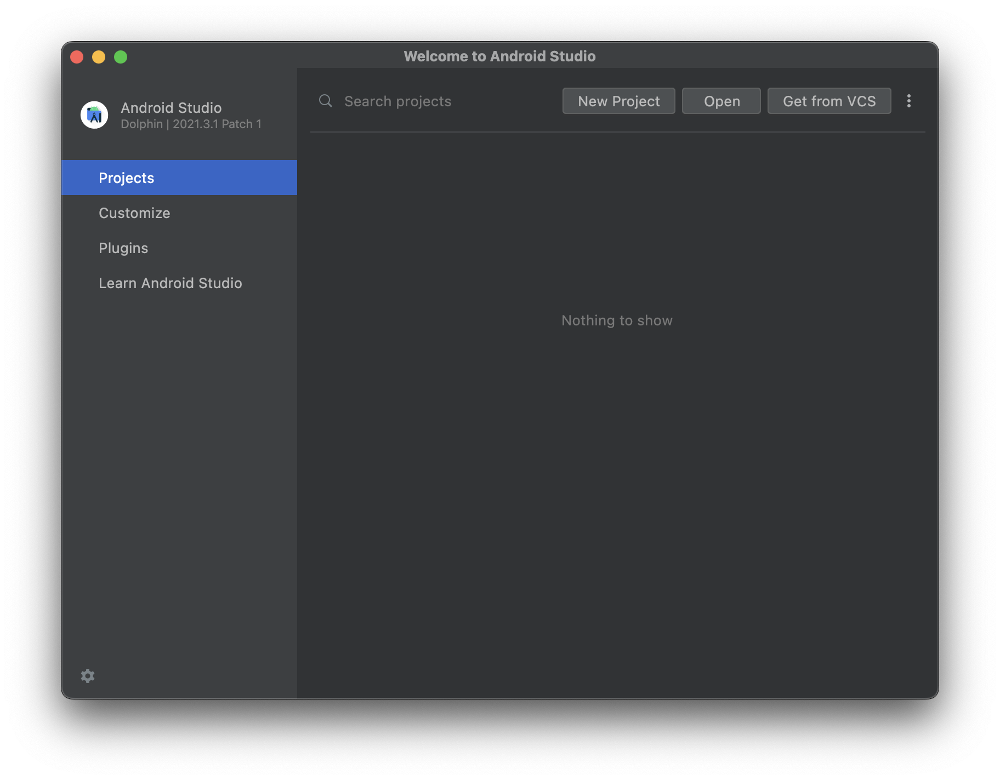

Although the final CBun App does not require any activity, you will need one for standalone UI test. Select the *Empty Activity* template and click the **Next** button. 

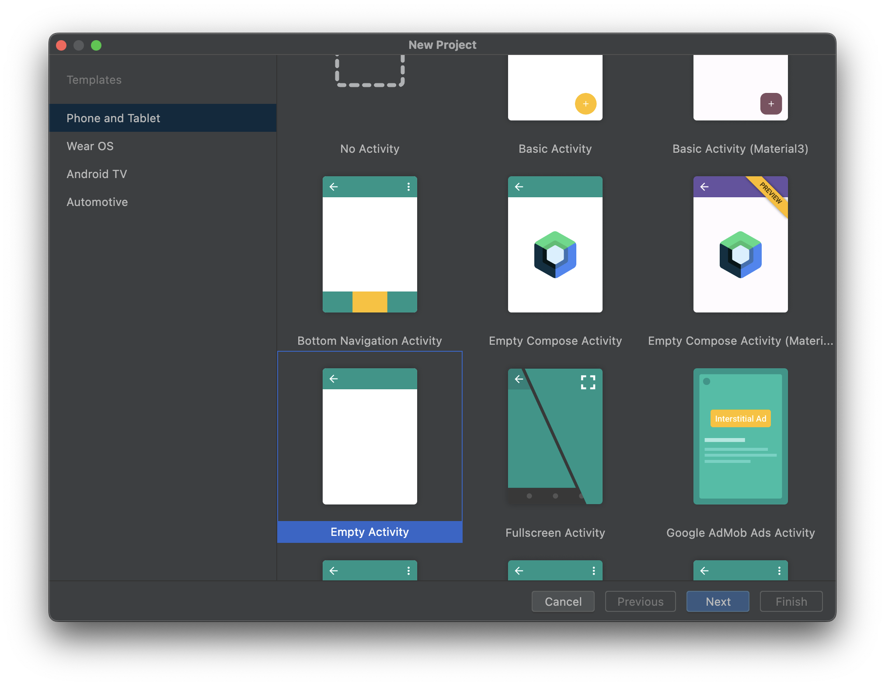

Fill in the name of your project, the package name (in form of <domain>.<project_name>) and select the language (this tutorial uses Kotlin). Choose API 28: Android 9.0 (Pie) as a minimum SDK in order to support all generations of our robots. Finally click the **Finish** button.

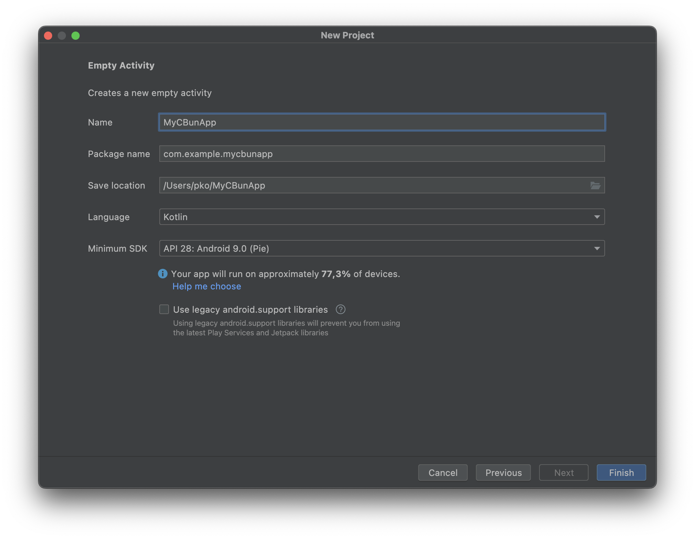

Configure Project Structure
===========================

Once the new project is created, you need to configure the gradle build tool and define project's dependencies, ie. the libraries that are used to build the CBun App. This step also describes how to add Jetpack Compose support to your project. All of that can me managed either via **File** -> **Project Structure** wizzard or by direct modification of appropriate build.gradle files. This tutorial demonstrates both ways. 

To ensure the full compatibility with the Teach Pendant host app, the Gradle and Gradle Plugin versions of your CBun App project have to match the target robot SW version (see the `Releases <../releases/releases.html>`_). Configure the gradle via the **Project** tab in the **Project Structure** wizzard. Once the gradle is configured, click the **Apply** button followed by the **OK** button.

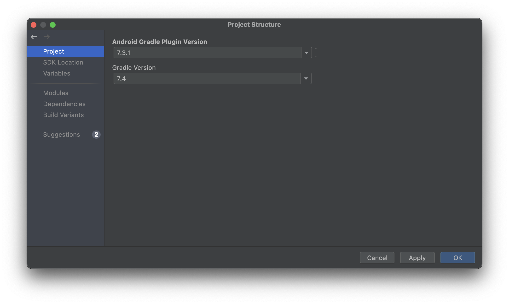

Now add the downloaded KR Android API library to your project by placing the api-external.aar file into the **libs** folder inside the **app** module directory. 

::

    MyCBunApp
    ├── app
    │   ├── libs
    │   │   └── api-external.aar
    │   └── ...
    ├── build.gradle
    ├── gradle
    │   └── ...
    ├── gradle.properties
    ├── gradlew
    ├── gradlew.bat
    ├── local.properties
    └── settings.gradle

Next tell your Android project to use this dependency. In order to add new dependencies, open the app module build.gradle file.

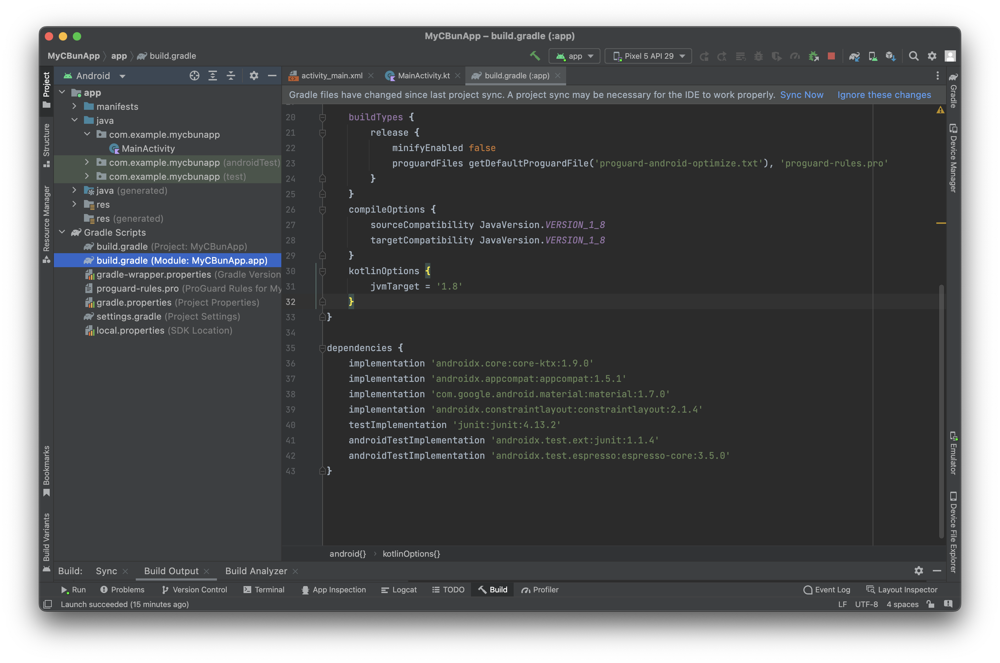

Add ``api files('libs/api-external.aar')`` entry into the **dependencies** section. Also add the following Jetpack Compose dependencies.

.. code-block:: yaml

    implementation 'androidx.compose.ui:ui:1.3.1'
    implementation 'androidx.compose.material:material:1.3.1'

In order to support Jetpack Compose, you need to mark its usage and define the Kotlin compiler version. Add the following code to the **android** section in your app module build.gradle.

.. code-block:: yaml

    buildFeatures {
        compose true
    }
    composeOptions {
        kotlinCompilerExtensionVersion '1.3.1'
        kotlinCompilerVersion '1.5.21'
    }

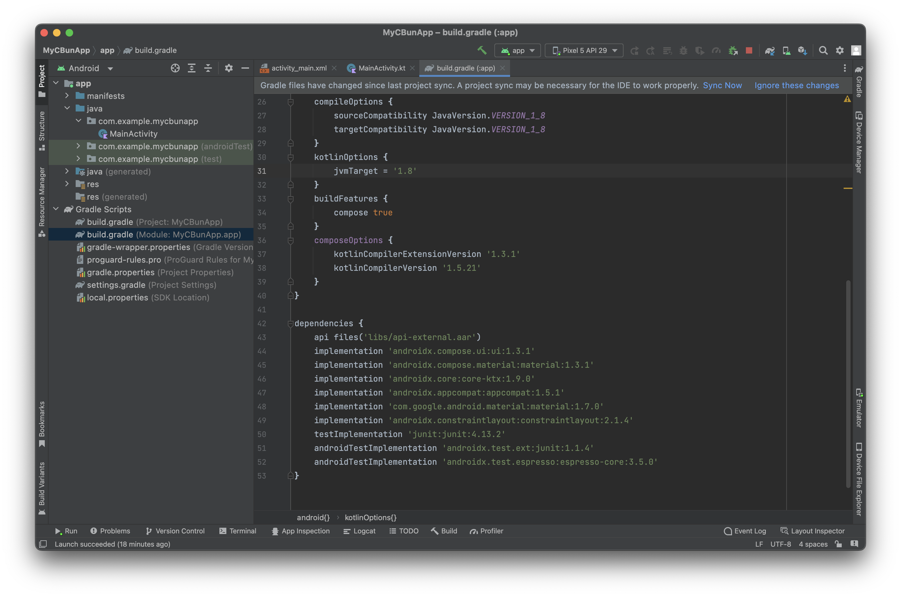

You might also need to adjust the Kotlin gradle plugin version in project build.gradle. 

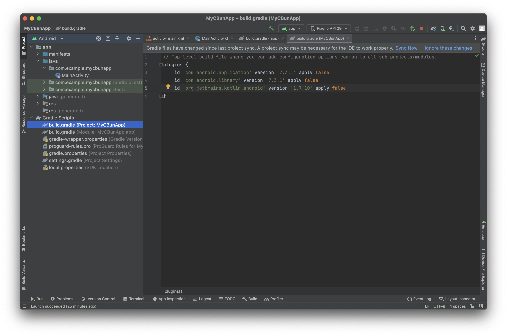

Finally click the **Sync Now** button to apply all modifications.

.. note::
    Make sure that dependencies, Kotlin compiler and Kotlin gradle plugin are compatible with the target robot SW version (see the `Releases <../releases/releases.html>`_). 

Add KRFragment
==============

Once the project is configured, add your first KRFragment entry-point. To add new class to your project, right-click the class target package (in your case `com.example.mycbunapp`) and select **New** followed by **Kotlin Class/File** from the popup menu.

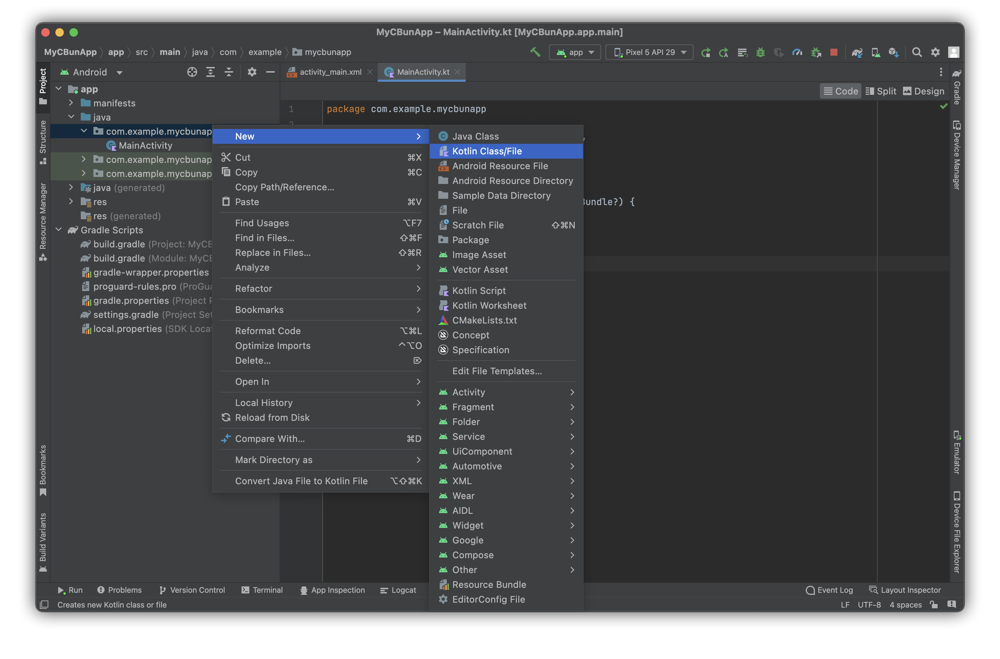

Enter `MyFragment` as a class name and press Enter.

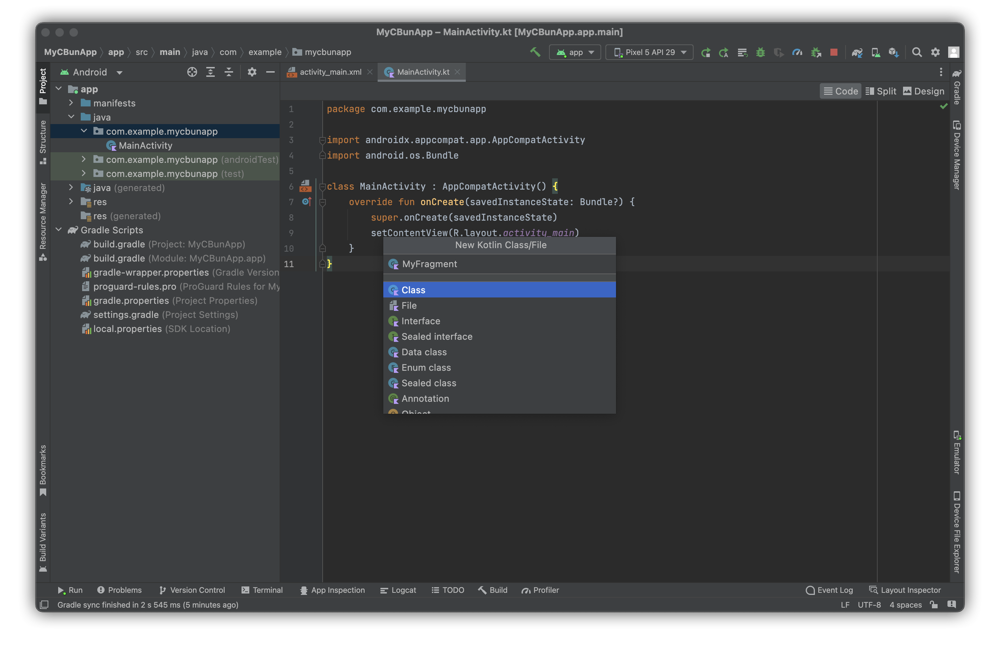

Once the MyFragment.kt class is created, you need to modify its content. First of all, this class has to extend the KRFragment base class. Next you need to implement the ``onCreateView`` method to provide your own UI. This method has to return a view, that will be rendered on the screen. In this tutorial, you will use Jetpack Compose, therefore the method has to return ``ComposeView``. Finally set the content of the view to ``Text`` composable with "Hello World!" message. 

.. code-block:: kotlin

    package com.example.mycbunapp

    import android.os.Bundle
    import android.view.LayoutInflater
    import android.view.View
    import android.view.ViewGroup
    import androidx.compose.material.Text
    import androidx.compose.ui.graphics.Color
    import androidx.compose.ui.platform.ComposeView
    import androidx.compose.ui.unit.sp
    import com.kassowrobots.api.app.fragment.KRFragment

    class MyFragment : KRFragment() {

        override fun onCreateView(
            inflater: LayoutInflater, container: ViewGroup?,
            savedInstanceState: Bundle?
        ): View {
            return ComposeView(requireContext()).apply {
                setContent {
                    Text("Hello World!",
                        color = Color.Blue,
                        fontSize = 30.sp
                    )
                }
            }
        }

    }

Run CBun in Emulator
====================

Although this code could be already packed into CBun and installed on the real robot, it would not be able to test it as a standalone Android application. The reason is, that there is no activity (ie. the entry-point of the standalone Android application) that would attach your fragment to the screen. Therefore you need to modify the layout of your empty activity (activity_main.xml). A fragment needs some container to be placed into. In this tutorial, you will use the ``FrameLayout`` container. Set the container width and height to ``match_parent`` and do not forget to assign an ID. 

.. code-block:: xml

    <?xml version="1.0" encoding="utf-8"?>
    <FrameLayout xmlns:android="http://schemas.android.com/apk/res/android"
        android:id="@+id/container"
        android:layout_width="match_parent"
        android:layout_height="match_parent"/>

Now modify the MainActivity.kt class to add a new instance of ``MyFragment`` to the container in ``onCreate`` method (ie. once the activity is created). 

.. code-block:: kotlin

    package com.example.mycbunapp

    import android.os.Bundle
    import android.view.View
    import android.view.Window
    import androidx.appcompat.app.AppCompatActivity

    class MainActivity : AppCompatActivity() {
    
        override fun onCreate(savedInstanceState: Bundle?) {
            super.onCreate(savedInstanceState)
            setFullscreen()
            setContentView(R.layout.activity_main)
            supportFragmentManager
                .beginTransaction()
                .add(R.id.container, MyFragment())
                .commit()
        }

        private fun setFullscreen() {
            requestWindowFeature(Window.FEATURE_NO_TITLE)
            window.decorView.systemUiVisibility = (View.SYSTEM_UI_FLAG_LAYOUT_STABLE
                    or View.SYSTEM_UI_FLAG_HIDE_NAVIGATION
                    or View.SYSTEM_UI_FLAG_FULLSCREEN
                    or View.SYSTEM_UI_FLAG_IMMERSIVE_STICKY)
        }

    }

Open **Tools** -> **Device Manager** to configure an emulated virtual device for the standalone application test. Click **Create device** button to add new virtual device. 

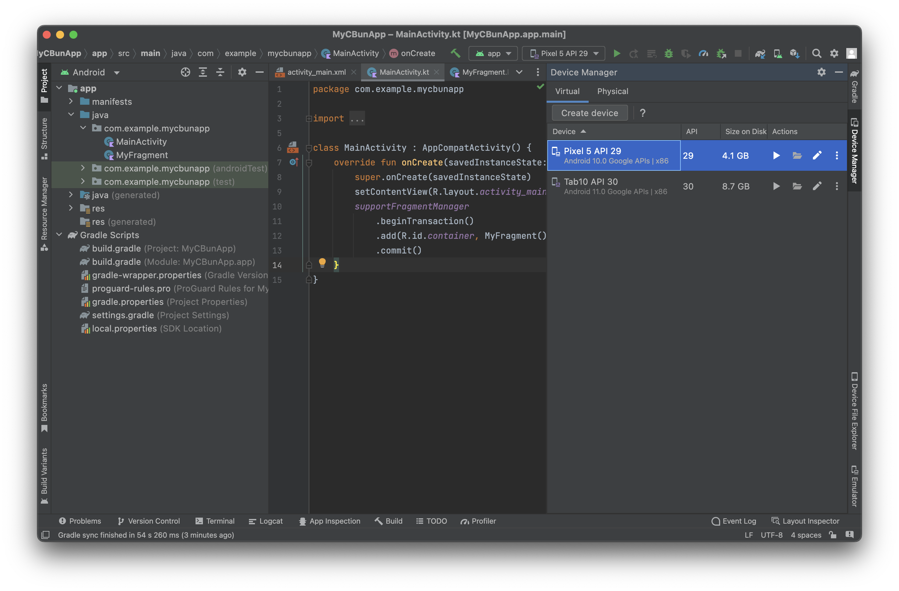

Click the **New Hardware Profile** to create new emulator profile, that will match the UI behaviour of the real robot in terms of the resolution and the density of pixels. 

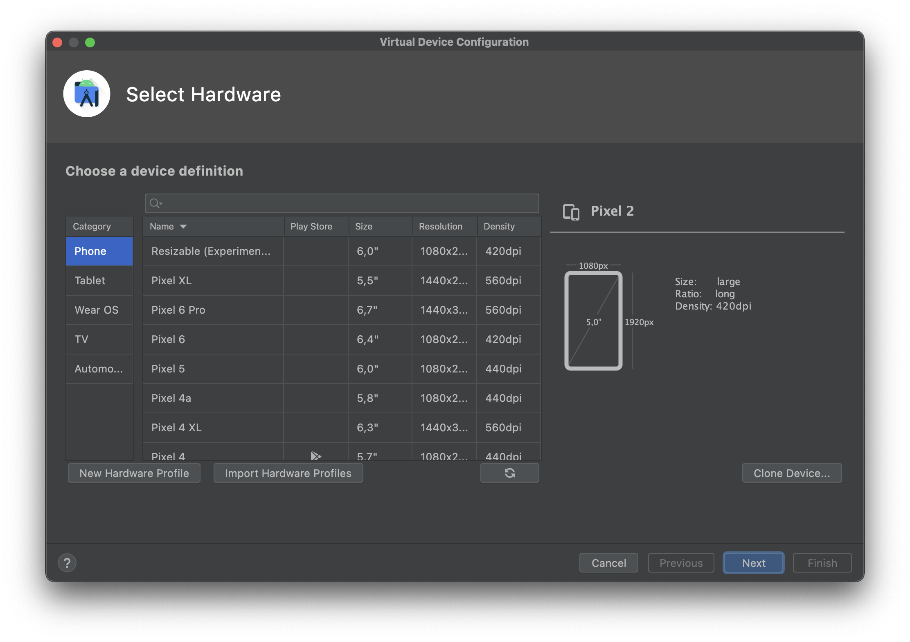

Enter the device name (for example CBun App Emulator) and configure the emulator resolution (932 x 987 px) and screen size (6.1") to fit the CBun App container in the Teach Pendant host app. The click the **Finish** button. 

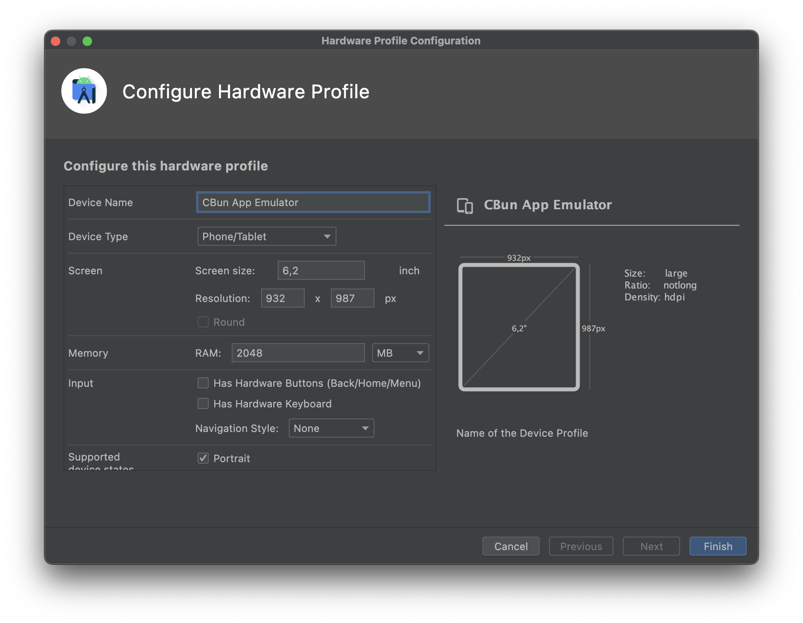

Once the new hardware profile is added, select it and click the **Next** button.

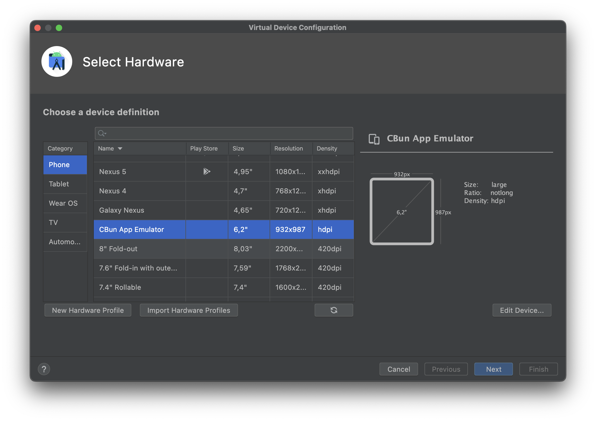

Select the **Q** system image, since Android 10 ensures compatibility with the highest amount of our robots. Then click the **Next** button.

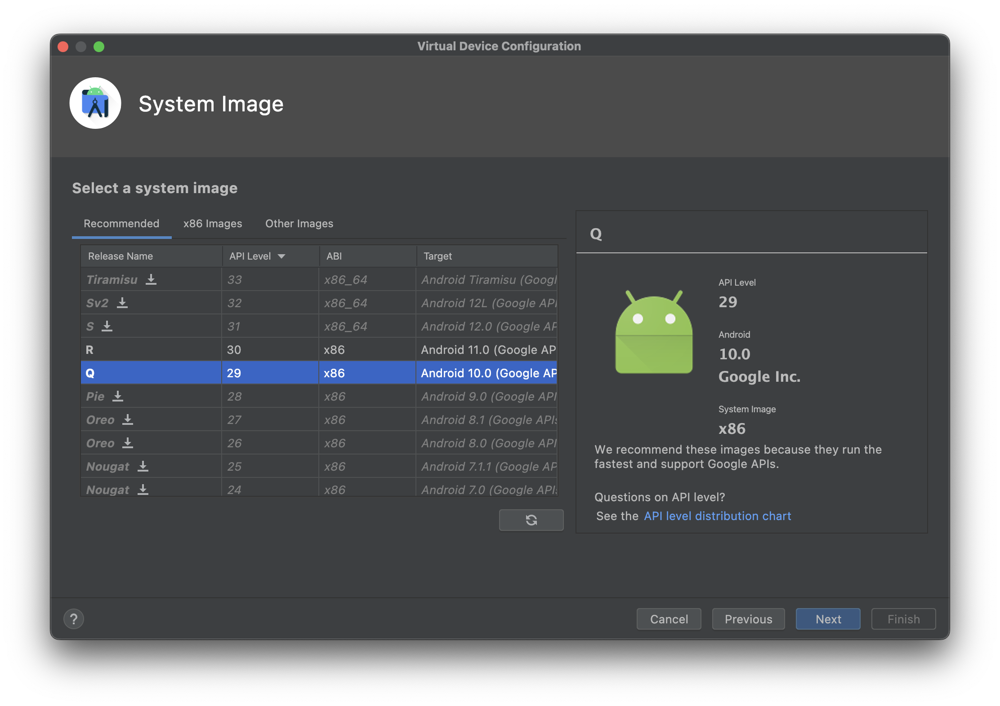

Check the device configuration, enter the AVD Name and click the **Finish** button.

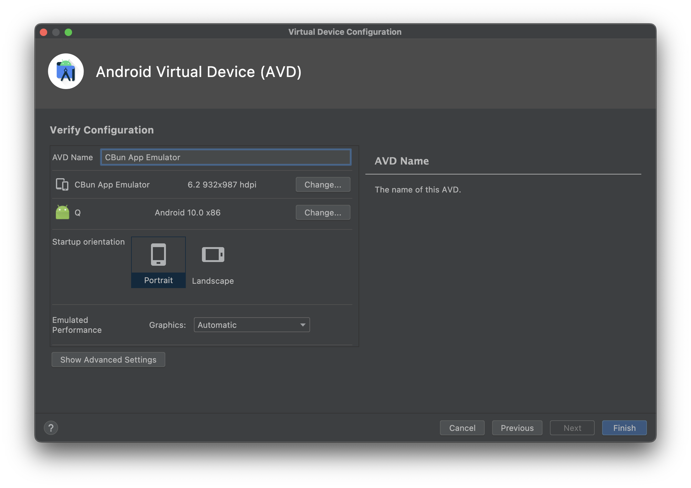

Finally click the run app button (or Ctrl-R shortcut) to launch your application in the emulator. 

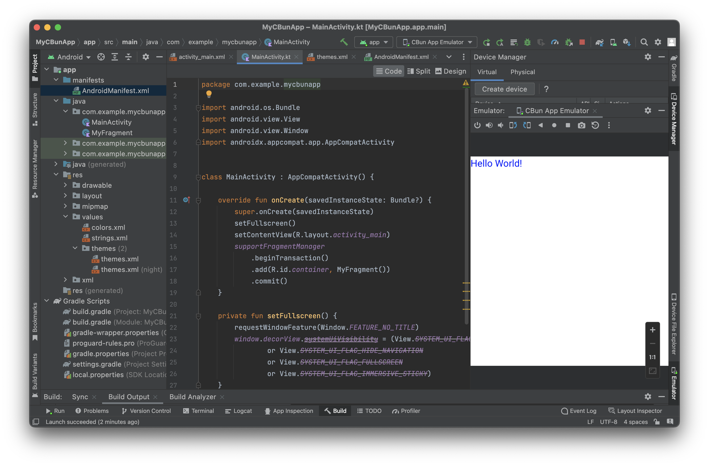

Define bundle.xml
=================

In order to run the CBun App on the real robot, the CBun has to contain a description in form of bundle.xml file. The bundle.xml tells the robot, which CBun Apps can be launched and which fragment entry-points are available for this purpose. 

Display your project files in **Project** view rather than the default **Android** view. Right-click the project root folder **MyCBunApp** and add the new **bundle.xml** file.   

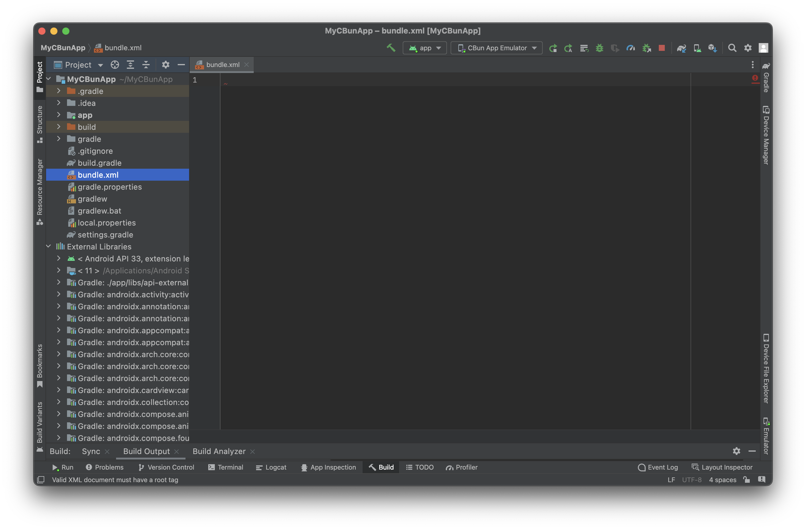

Be careful while defining the bundle.xml file, since its content has to be perfectly aligned with the configuration of the Android project, ie. the ``package`` attribute of ``application`` element has to match the package of your Android project (in your case it is ``com.example.mycbunapp``). Also the ``name`` attribute of ``fragment`` element has to represent the path to your KRFragment relatively to the package (in your case it is ``.MyFragment``). 

.. note::
   If you join the ``package`` application attribute with the ``name`` fragment attribute, it matches the fully qualified name of your KRFragment, ie. ``com.example.mycbunapp.MyFragment``.  

Use the following intent-filter to make the CBun App accessible from the Workcell tool:

.. code-block:: xml
 
   <intent-filter>
       <action name="com.kassowrobots.intent.action.MAIN"/>
       <category name="com.kassowrobots.intent.category.LAUNCHER"/>
   </intent-filter>

Finally, the ``apk`` attribute in ``application`` element has to represent the path to the output APK in your CBun (see Assemble CBun section). Your final bundle.xml file may look like this:

.. code-block:: xml

    <?document type="cbunxml" version="1.0" ?>
    <bundle name="MyFirstCBun" version="1.0.0" path="" type="custom">
        <label>My First CBun</label>
        <author>Kassow Robots</author>
        <description>My first CBun implemented in Kotlin using Jetpack Compose.</description>
        <application
            package="com.example.mycbunapp"
            label="My CBun App"
            apk="/mycbunapp.apk">
            <fragment
                name=".MyFragment"
                debuggable="true">
                <intent-filter>
                    <action name="com.kassowrobots.intent.action.MAIN"/>
                    <category name="com.kassowrobots.intent.category.LAUNCHER"/>
                </intent-filter>
            </fragment>
        </application>
    </bundle>

Assemble CBun
=============

First of all, you need to build the APK. In order to do so, click the **Build** -> **Build Bundle(s) / APK(s)** -> **Build APK(s)**. The APK file will be accessible at ``<yourpath>/MyCBunApp/app/build/outputs/apk/debug/app-debug.apk`` path.

Once the APK is generated and bundle.xml is defined, it can be assembled into the CBun file. The CBun file is simply a tarball of the package with the following structure:

::

    CBun
    ├── bundle.xml
    └── mycbunapp.apk

This document demonstrates, how to manually assemble CBun using bash. Run the following commands from the root of your Android project.

.. code-block:: sh

    mkdir assemble
    cd assemble
    mkdir MyFirstCBun
    cp ../bundle.xml ./MyFirstCBun
    cp ../app/build/outputs/apk/debug/app-debug.apk ./MyFirstCBun/mycbunapp.apk
    tar -cvzf ../myfirstcbun.cbun -C ./MyFirstCBun .
    cd .. 
    rm -rf assemble

Finally, the ``myfirstcbun.cbun`` file is generated in the root folder of your Android project.

Run CBun on Real Robot
======================

There are two ways for installing a 3rd party CBun. The CBun can be installed either from the USB flash drive or from the Google Drive. For the purpose of this tutorial, put your CBun onto a USB stick and plug the stick to the robot cabinet. Go to **Settings** -> **CBuns** and click the **+** button. Select your USB device and click the **myfirstcbun** file. 

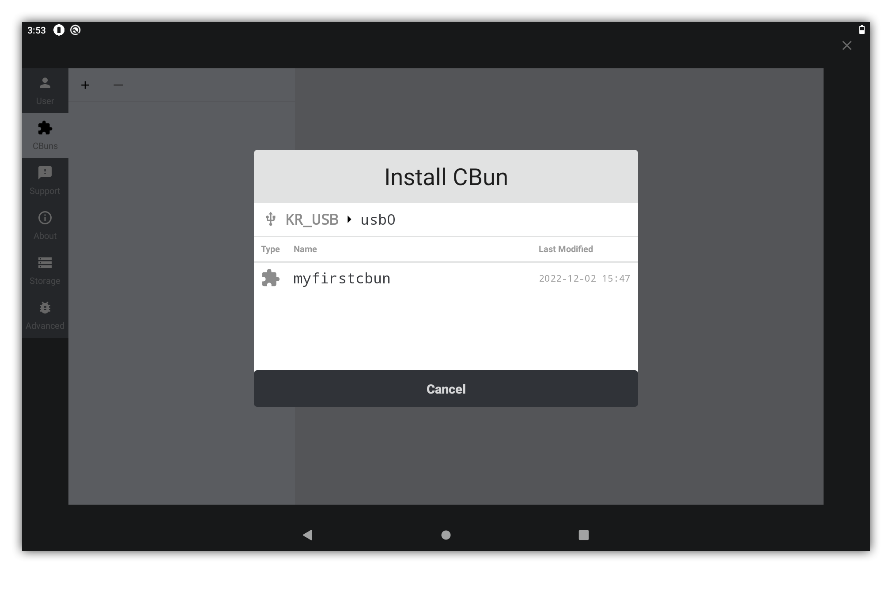

Confirm the installation of your CBun by clicking the **Install** button. 

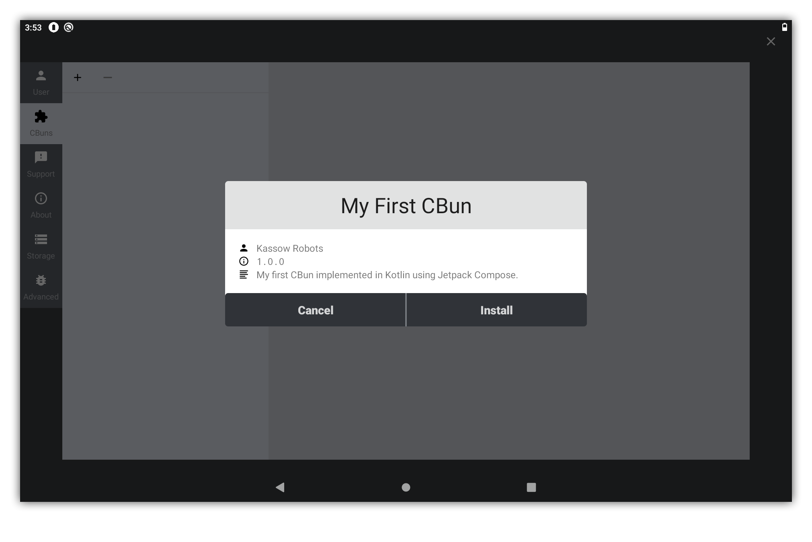

Go to **Workcell** tool and click **My CBun App** item in **CBun Apps** section to launch your first CBun App. 

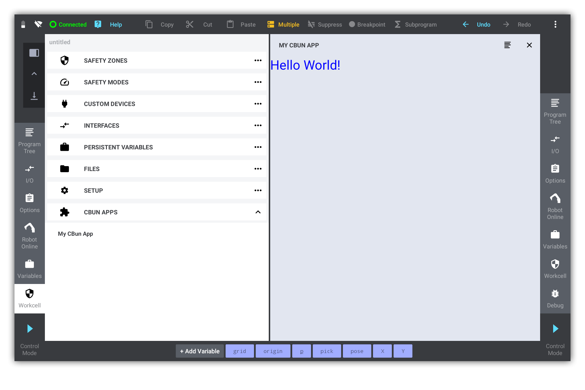
