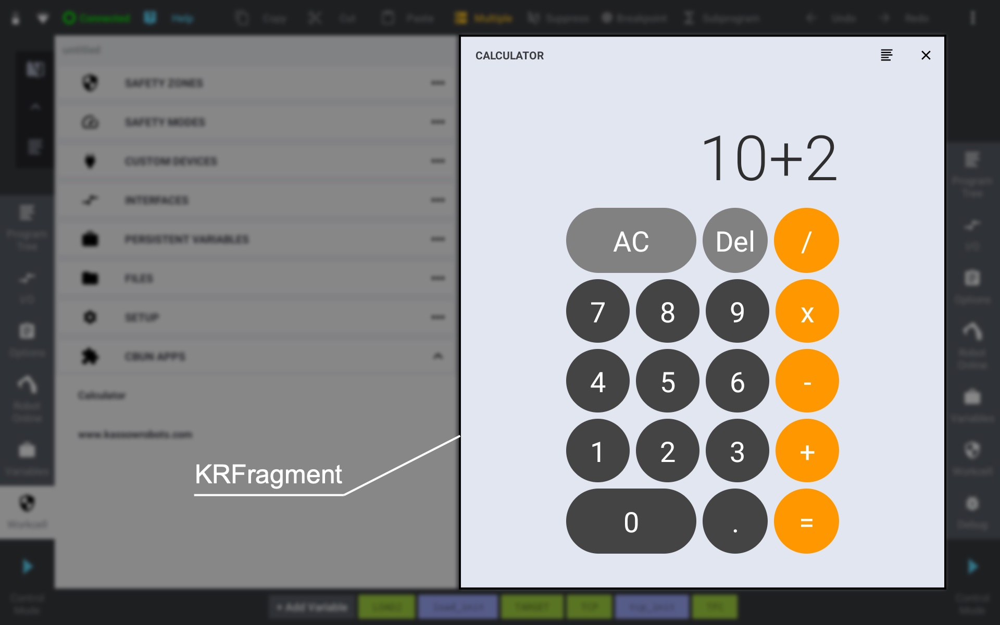

************
Introduction
************

CBun App can be developed almost the same way like any other Android application. It is based on the same fundamentals, such as

* Java and Kotlin programming languages
* Android SDK and 3rd party libraries
* XML, Java or Kotlin (Jetpack Compose) user interface declaration
* Gradle build tool

During the development process, the CBun App can be build, launched and tested as a standalone Android application on any Android device (either real or emulated). Eventually, the generated APK can be packed into a CBun file and installed on a real robot.  

KRFragment
==========

KRFragment is the essential component of CBun App, since it provides an entry point for interacting with the user. KRFragment represents user interface (UI) of the CBun App on the Teach Pendant screen, therefore each KRFragment has to:  

* define the UI layout
* handle user inputs

Once the user launches CBun App, the appropriate KRFragment is automatically constructed and placed over one of the tool panels (whether it will be the left or right panel depends on the application context).

  KRFragment of Calculator CBun App

You implement your own CBun App UI as a subclass of the :ref:`krfragment_class` class. This UI is based on the standard Android `fragment <https://developer.android.com/guide/fragments>`_ (ie. KRFragment is derived from Fragment class), but the fragment is attached to the screen with the KRContext instead of the base Android Context.     

KRContext
=========

KRContext is an interface to global information about CBun App environment. It allows access to CBun App specific classes, and resources (such as strings, layouts, images, etc.). It also provides handles to KR services that represent interface to some of the Teach Pendant host application features.

KRContext is based on standard Android `context <https://developer.android.com/reference/android/content/Context>`_ (ie. KRContext is derived from Context class). It is constructed automatically by the Teach Pendant host application on the CBun App start and its instance is passed to the KRFragment once the fragment is attached to the screen. 

.. warning::
   Make sure that you always use KRContext rather than the base Android Context. Whereas the base Context will work in a standalone CBun App, it may fail when installed on a real robot. 

The bundle.xml file
===================

The bundle.xml file describes the CBun to the robot and it has to be packed with each CBun. The bundle.xml has been already used for the description of Custom Devices, therefore this document will focus only on the declaration of CBun Apps via the new ``<application>`` element. 

.. code-block:: xml

       
    <?document type="cbunxml" version="1.0" ?>
    <bundle name="CalculatorCBun" version="1.0.0" type="custom">
        ...
        <application
            package="com.kassowrobots.calculator"
            apk="/calculator.apk">
            <fragment
                name=".CalculatorFragment"
                label="Calculator"
                icon="ic_calc.png" >
                <backend>...</backend>
                <intent-filter>...</intent-filter>
            </fragment>
            ...
        </application>
    </bundle>

In the ``<application>`` element, the ``package`` attribute specifies the CBun App package name and it has to be aligned with the package name in your CBun App Android project. The ``apk`` attribute defines the path to the relevant APK relatively to the root of the CBun package.

The ``<fragment>`` element defines an entry point of the CBun App. Its ``name`` attribute specifies the qualified class name (relatively to the application package) of the KRFragment subclass. The ``label`` attribute declares a string to be used as the user-friendly label for this CBun App entry point and the optional ``icon`` attribute specifies a path to app icon relatively to the APK drawable folder. 

The ``<backend>`` element defines optional `backend`_ of the CBun App. This element is optional and has to be defined only if a backend is used.

The ``<intent-filter>`` element specifies the types of intents that can launch the CBun App. 

CBun App Launch
===============

CBun App can be launched from Teach Pendant host application on user interaction only. There are various places in the Teach Pendant host application that allow to launch a CBun App by clicking its launcher, such as:

* CBun Apps section in the Workcell tool
* Define Pose popup menu in RobotPose variable options panel 
* Custom device dashboard icon

Whether the CBun App launcher is listed in one of these locations depends on the intents, that the CBun App can handle. The set of intents that the CBun App entry-point (fragment) responds to, is declared by ``<intent-filter>`` element in bundle.xml file. 

Action ``MAIN`` together with the ``LAUNCHER`` category represents the standard CBun App launcher. Such application is listed in the Workcell -> CBun Apps section. 

.. code-block:: xml

    <intent-filter>
        <action name="com.kassowrobots.intent.action.MAIN"/>
        <category name="com.kassowrobots.intent.category.LAUNCHER"/>
    </intent-filter>

Action ``DEFINE_POSE`` signals a CBun App that allows to define value of a general RobotPose variable. Such CBun App is accessible via Define Pose popup menu from options panel of any RobotPose variable.

.. code-block:: xml

    <intent-filter>
        <action name="com.kassowrobots.intent.action.DEFINE_POSE"/>
    </intent-filter>

Action ``DEFINE_TCP`` signals a CBun App that allows to define value of a RobotPose variable that either maps the real TCP frame (in case of system variable) or represents its coordinates (in case of custom variable).  

.. code-block:: xml

    <intent-filter>
        <action name="com.kassowrobots.intent.action.DEFINE_TCP"/>
    </intent-filter>

.. note::
   Various actions and categories can be combined together either in the same intent-filter or by using multiple intent-filters.

Backend
=======

Each CBun App entry-point (fragment) may be equipped with optional backend. This backend is automatically initialized on a CBun App start and cleaned on a CBun App exit. The communication between frontend and backend is based on XML-RPC, where the frontend acts as a client and the backend represents the XML-RPC server.

You implement your own backend in C++ as a subclass of the ``kr2_bundle_api::CBunClass``. The backend class has to be described to the robot by specifying the ``<backend>`` element in `the bundle.xml file`_.

.. code-block:: xml

   <backend lib="/libcalculator">
       <class name="calculator_cbun::Calculator" 
           base="kr2_bundle_api::CBunClass" 
           group="__calc__"/>
   </backend>

In the ``<backend>`` element, the ``lib`` attribute specifies the path to the relevant library (\*.so) relatively to the root of the CBun package. 

In the ``<class>`` element, the ``name`` attribute defines the qualified C++ class name and the ``base`` attribute specifies the base class (``kr2_bundle_api::CBun
Class`` is now the only option). The ``group`` attribute identifies the CBun Sandbox process and it is important for the XML-RPC communication, since it represents the address of the XML-RPC server.  
