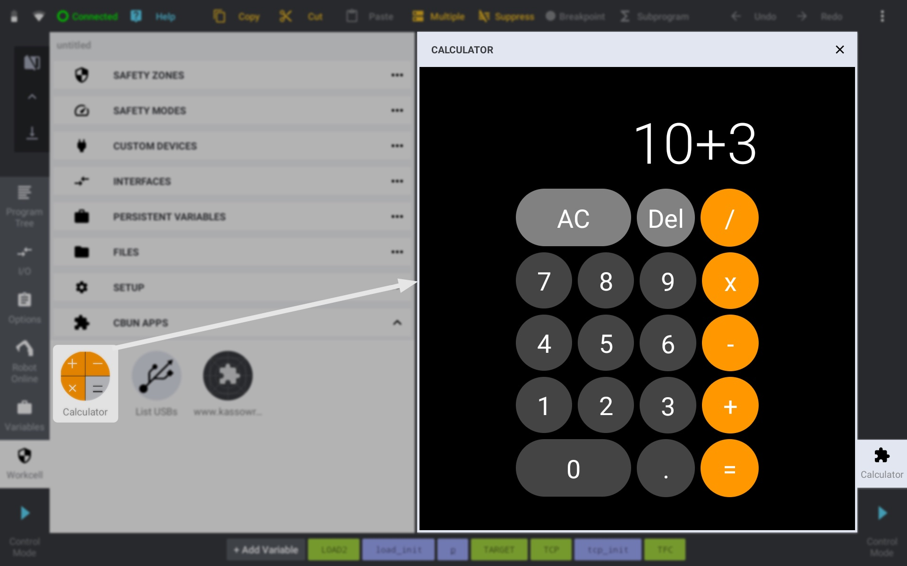
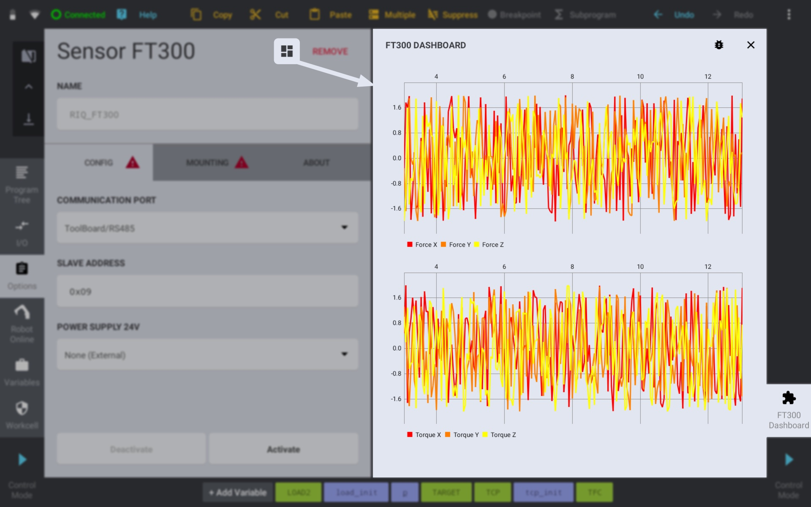
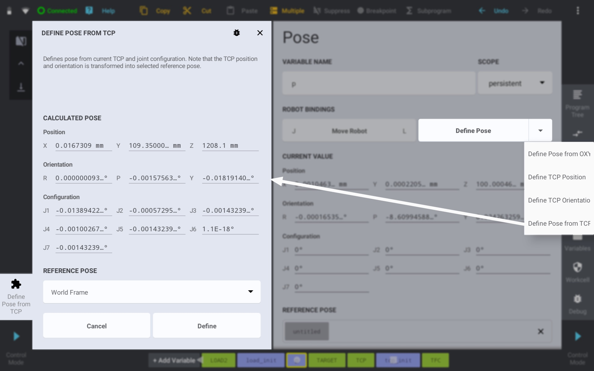

*********
Use Cases
*********

There are multiple ways how the CBun App can be integrated into the Teach Pendant host application, such as

* standalone app
* device dashboard
* define pose/tcp tool 

Each of these use cases is designed to satisfy some specific user intent.

Standalone App
==============

Standalone app is the basic and most open use case. Such CBun App does not have any constraints regarding its purpose. It can be a calculator, web browser, robot control app or a maintenance wizzard. It is listed in Workcell -> CBun Apps section and the user can launch it by clicking its icon.   

  standalone app use case

The standalone CBun app is specified via the proper ``<intent-filter>`` element that combines action ``MAIN`` together with the ``LAUNCHER`` category. This ensures that the CBun app will be listed in the CBun Apps section of the Workcell.

.. code-block:: xml

    <?document type="cbunxml" version="1.0" ?>
    <bundle name="CalculatorCBun" version="1.0.3" path="" type="custom">
        <label>Calculator CBun</label>
        <author>Kassow Robots</author>
        <description>Calculator example CBun implemented in Kotlin using Jetpack Compose.</description>
        <application
            package="com.kassowrobots.calculator"
            label="Calculator"
            icon="ic_calc.png"
            apk="/calc.apk">
           <fragment
              name=".CalcFragment">
              <intent-filter>
                <action name="com.kassowrobots.intent.action.MAIN"/>
                <category name="com.kassowrobots.intent.category.LAUNCHER"/>
              </intent-filter>
           </fragment>
        </application>
    </bundle>

Device Dashboard
================

Device dashboard app is related to some specific custom device. It allows the developers to extend the automatically generated custom device UI with their own CBun App UI. It can be utilised for plotting the sensor data, controlling the gripper, configuration of some vision system and much more. The device dashboard app can be launched by clicking the custom device dashboard icon.  

  device dashboard use case

The dashboard CBun app can be developed the same way like the standalone CBun App. The difference lies in the description of the application via bundle.xml. There is no need to specify the intent-filter for the dashboard app, since it will be launched explicitly. Instead, the fully qualified fragment ``class`` attribute has to be specified within the custom device ``<dashboard>`` element. 

.. code-block:: xml

    <bundle name="VirtualDevices" version="1.0.0" path="libcbun_virtual_devices">
        ...
        <class name="kswx_virtual_devices::Gripper"
            base="kr2_bundle_api::CustomDevice"
            instance_prefix="GRIPPER">
            <dashboard class="com.kassowrobots.virtualdevices.Gripper"/>
            ...
        </class>
        <application
            package="com.kassowrobots.virtualdevices"
            apk="/virtual_devices.apk">
            <fragment
                name=".Gripper"
                label="Gripper Dashboard"
                icon="ic_gripper.png">
            </fragment>
        </application>
    </bundle>

Dashboard fragment is always launched with the unique device name argument. This argument identifies the specific device instance that was used to launch the dashboard. Such information can be utilised to the proper addressing of C++ backend via XML-RPC (for example when 2 grippers are attached to the robot). The device name can be obtained within the KRFragment class by calling the following code:

.. code-block:: java

    String deviceName = requireArguments().getString(KRFragment.ARG_DEVICE_NAME);

Define Pose Tool
================

Define pose tools allow the user to set robot pose coordinates in various ways, from the simplest ones (such as using current coordinates of the TCP frame) to more sophisticated ones (such as frame calculation from OXYZ). The define pose tools are accessible within the robot pose options panel.  

  define pose tool use case

The dashboard CBun app can be developed the same way like the standalone CBun App. The difference lies in the description of the application via bundle.xml. The define pose tool intent-filter has to specify ``DEFINE_POSE`` and/or ``DEFINE_TCP`` action. 

.. code-block:: xml

    <bundle name="DefinePoseTools" version="1.0.0" path="libcbun_define_pose_tools">
        ...
        <application
            package="com.kassowrobots.definepose"
            label="Define Pose"
            apk="/nitro_tools.apk">
           <fragment
              name=".fromtcp.view.DefinePoseFragment"
              debuggable="true"
              label="Define Pose from TCP">
              <intent-filter>
                 <action name="com.kassowrobots.intent.action.DEFINE_POSE"/>
              </intent-filter>
           </fragment>
        </application>
    </bundle>